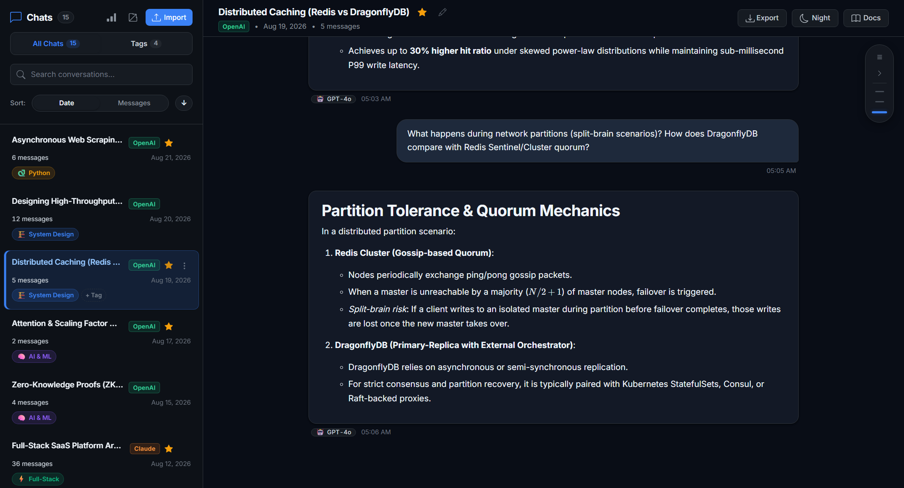
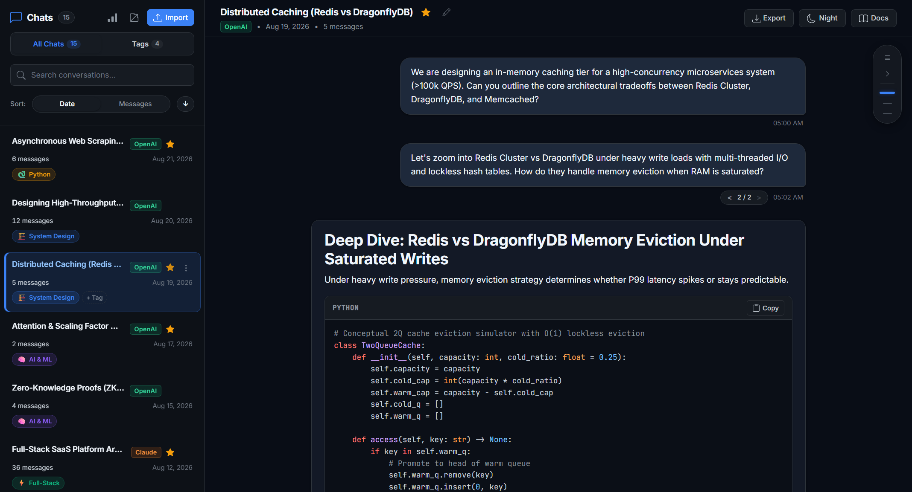
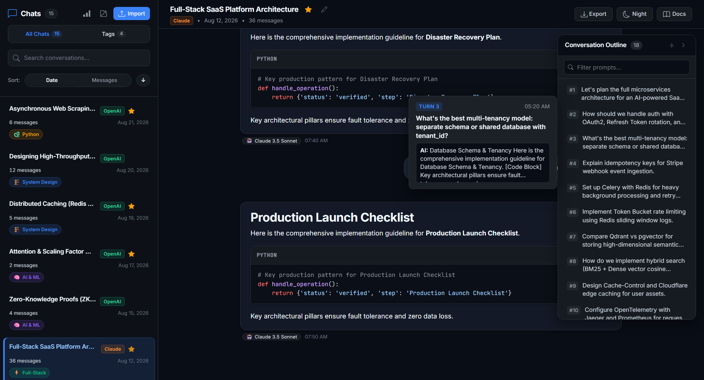
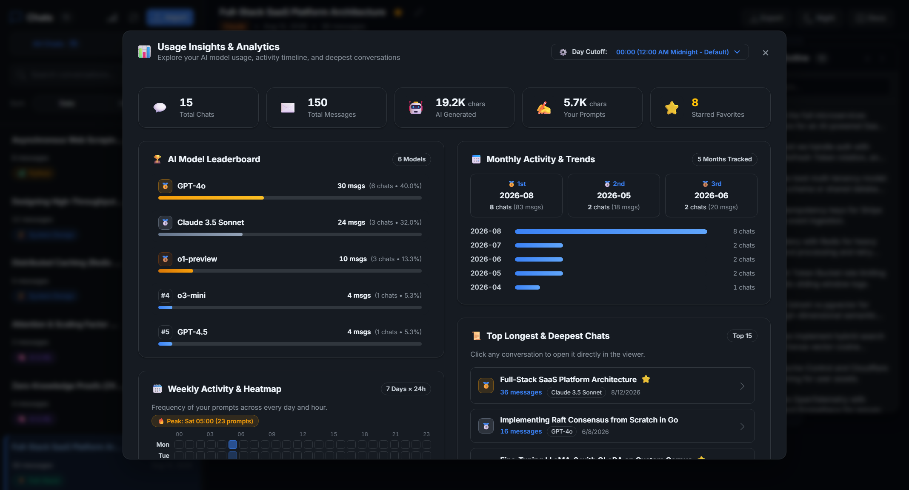
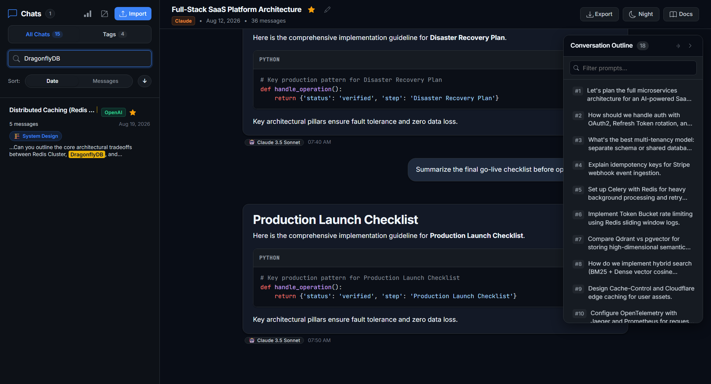
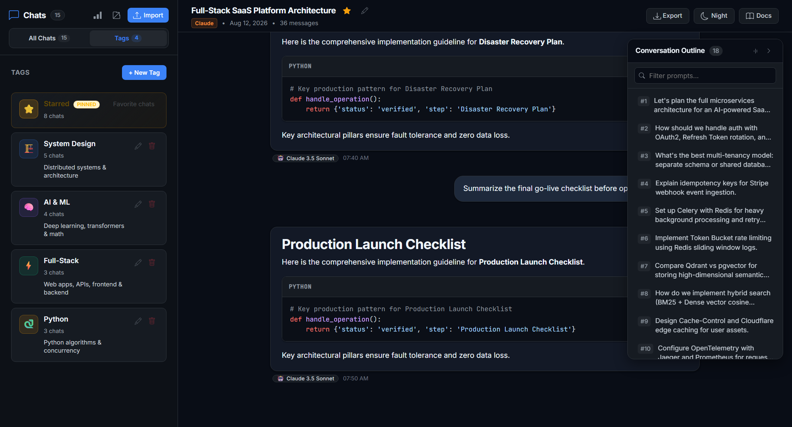
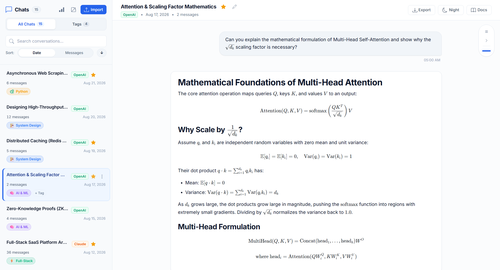

# LLM Chat Vault (Desktop & Web)

[](LICENSE)
[]()
[]()
[]()
[]()

An extensible desktop application and local archive vault for viewing, navigating, searching, and analyzing chat histories exported from **ChatGPT (OpenAI)**, **Claude (Anthropic)**, and **Z.ai**.

Built with a local-first SQLite persistence engine, full conversation DAG branch tree traversal, interactive usage analytics, and an adaptive reading navigator.

---

## Key Highlights

- **Permanent Local Database**: Stores tens of thousands of conversations locally in SQLite (WAL mode) with instant startup and zero data loss on application restart.
- **Full DAG Conversation Branching**: Full support for prompt edits, alternative branches, and assistant regenerations with interactive `< 1 / 2 >` version pagination.
- **Adaptive Outline & Timeline Navigator**: Automatically adapts between a minimal Claude-style timeline spine for compact chats and a searchable ChatGPT-style outline drawer for long-form discussions, complete with hover tooltips and synchronized reading position.
- **Usage Insights & Analytics Dashboard**: Built-in analytics modal tracking AI model usage breakdown, 7&times;24-hour activity heatmaps, peak activity hours, and monthly volume trends.
- **Global Full-Text Search (FTS5)**: Millisecond-level full-text search across titles and all message contents with instant keyword snippet highlighting.
- **Tags, Favorites & Customization**: Color-coded custom tag system, star bookmarking, custom conversation renaming, and light/dark theme switching (`Alt + T`).
- **Multi-Modal & Media Attachments**: Automatic extraction and rendering of image attachments, audio files, and `.dat` assets from export archives with lightbox previews.
- **100% Offline & Private**: Zero external telemetry or third-party server transmissions. All conversations and database files remain strictly on your local machine.

---

## Feature Tour

### 1. Modern Workspace & Dark / Light Theme
The interface features a distraction-free reading column, syntax-highlighted code blocks with 1-click copy buttons, model badge indicators, and responsive theme support.



---

### 2. Full Conversation Branching (DAG Version Switcher)
Unlike basic linear viewers that flatten or drop branched responses, the viewer reconstructs the entire Directed Acyclic Graph (DAG). When you navigate between alternative branches or prompt edits, the engine resolves downward to the deepest leaf node, ensuring the entire downstream thread is preserved.



---

### 3. Adaptive Chat Navigator & Hover Preview
For short conversations (< 15 turns), the viewer displays a minimal timeline spine. For longer, complex conversations (&ge; 15 turns), it expands into a searchable outline drawer with real-time prompt filtering and live hover tooltips displaying the user prompt and AI response snippet.



---

### 4. Usage Insights & Analytics Dashboard
Gain deep visibility into your conversation history and AI interaction habits:
- **Model Leaderboard**: Usage distribution across GPT-4o, Claude 3.5 Sonnet, o1/o3, Deep Research, and custom models.
- **7 &times; 24h Activity Heatmap**: Visual frequency grid across all 168 hours of the week with automatic Peak Hour detection.
- **Monthly & Weekly Trends**: Monthly conversation histograms and day-of-week volume distribution.
- **Deepest Conversations**: Quick-access ranking of your longest discussions.



---

### 5. Global Full-Text Search (FTS5)
Search through your entire chat archive using SQLite FTS5. Matches in conversation titles and individual message contents are retrieved in milliseconds, with highlighted keyword snippets shown directly in the sidebar cards.



---

### 6. Organization, Tags & Starred Chats
Group related conversations with custom tags, assign custom colors and icons, and bookmark important sessions for fast retrieval.



---

### 7. Mathematics, LaTeX & Light Mode
Full support for inline and block mathematical formulas, code blocks, tables, and seamless light mode.



---

## Supported Import Formats

| Source | Supported File Types | Notes |
| :--- | :--- | :--- |
| **ChatGPT (OpenAI)** | `.zip`, `.json` | Supports standard and chunked multi-file export folders (`conversations.json`, `chat_history.json`). Preserves full branch trees, image/audio attachments, and metadata. |
| **Claude (Anthropic)** | `.json` | Parses complete message history, file attachments, and metadata. |
| **Z.ai** | `.json` | Preserves conversation tree structures, model attributes, and token usage metrics. |
| **Normalized Re-import** | `.json` | Standardized format exported directly from this application. |

---

## Getting Started

### Prerequisites
- **Python 3.8+** (for local backend server & database management)
- **Node.js 18+** (optional, if running or building via Electron)

### Method A: Standalone Electron Desktop App (Windows)
1. Run the one-click launcher script in the project root:
   ```cmd
   Launch_Chat_Vault.bat
   ```
2. Or launch the unpacked executable directly:
   ```cmd
   dist\win-unpacked\LLM Chat Vault.exe
   ```

### Method B: Running via Local Web Server
1. Start the local Python backend server:
   ```bash
   python -m server.app 8000
   ```
2. Open your browser and navigate to:
   ```
   http://127.0.0.1:8000
   ```
3. Drag and drop your `.zip` or `.json` export file directly onto the window to begin exploring.

---

## Architecture Overview

```
llm-chat-vault/
├── assets/                  # Icons, fonts, and bundled vendor libraries
├── css/                     # Application stylesheets & design system
├── docs/                    # Architectural specs and screenshots
│   └── screenshots/         # Feature demonstration screenshots
├── js/
│   ├── app.js               # Main application coordinator
│   ├── parsers.js           # Multi-format detection and AST normalization
│   ├── ui/
│   │   ├── chat-view.js     # Message canvas, code copy, and branch UI
│   │   ├── chat-navigator.js# Adaptive outline & timeline spine component
│   │   ├── sidebar.js       # Conversation list, search, tags, and context menu
│   │   ├── insights-modal.js# Analytics dashboard & heatmap visualizations
│   │   ├── markdown.js      # Markdown & code block processing
│   │   └── theme.js         # Theme management and preference persistence
│   └── utils/
│       ├── api-client.js    # REST client communicating with Python backend
│       ├── db.js            # Client-side IndexedDB v2 fallback
│       ├── export.js        # Markdown, HTML, JSON, and text exporter
│       └── file-handler.js  # ZIP decompression and drag-and-drop ingestion
├── server/
│   ├── app.py               # Lightweight REST API and static server
│   ├── db.py                # SQLite persistence, DAG resolution & FTS5 search
│   ├── importer.py          # Batch ingestion & media extraction pipeline
│   └── parser.py            # Backend export parsing and surrogate sanitization
├── tests/                   # Automated pytest and unittest test suite
├── electron-main.js         # Electron desktop process orchestration
└── package.json             # Desktop app configuration & build scripts
```

---

## Privacy & Security

- **100% Offline Execution**: All file parsing, database queries, full-text indexing, and analytics calculations happen on your local machine.
- **No External Network Calls**: The application does not communicate with external analytics, trackers, or remote APIs.
- **Local Storage Location**: When running as a desktop app, your database is saved locally in `%APPDATA%\llm-chat-vault\conversations.db`.

---

## Acknowledgements & Credits

This project is built upon and significantly enhanced from the open-source repository [**TomzxCode/llm-conversations-viewer**](https://github.com/TomzxCode/llm-conversations-viewer) by [Tom Rochette](https://github.com/TomzxCode), distributed under the MIT License.

Key enhancements introduced in this edition:
- Native Electron desktop packaging and automated backend process lifecycle management.
- Local persistent SQLite database with WAL mode and FTS5 full-text search.
- Full DAG branch tree navigation with intermediate-node descendant resolution.
- Adaptive conversation outline & timeline navigator with synchronized reading tracking.
- Interactive usage analytics dashboard with 7&times;24h heatmap and model leaderboard.
- Multi-modal attachment ingestion and OpenAI chunked multi-file export support.
- Color-coded tag system, starred chats, custom renaming, and modernized theme engine.

---

## Author & Contributors

- **Author**: Shurui Li ([@shuruili77](https://github.com/shuruili77))
- **AI-Assisted Engineering**: Developed and accelerated with **Google Antigravity**.

---

## License

This project is licensed under the [MIT License](LICENSE).

